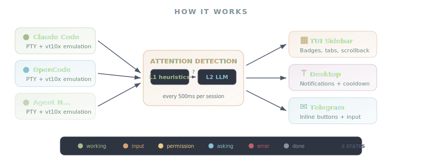

<picture>
  <source media="(prefers-color-scheme: dark)" srcset="assets/logo-dark.svg">
  <source media="(prefers-color-scheme: light)" srcset="assets/logo-light.svg">
  
</picture>

<a href="https://github.com/wilfoa/openconductor/actions"></a>
<a href="https://github.com/wilfoa/openconductor/releases"></a>
<a href="LICENSE"></a>
<a href="https://golang.org/dl/"></a>

[Installation](#installation) &ensp;&middot;&ensp; [Quick Start](#quick-start) &ensp;&middot;&ensp; [Features](#features) &ensp;&middot;&ensp; [Telegram](#telegram) &ensp;&middot;&ensp; [Architecture](#architecture) &ensp;&middot;&ensp; [Contributing](CONTRIBUTING.md)

---

You're running five AI agents across five repos. Each lives in its own terminal tab. When one finishes, you don't notice for twenty minutes. When one asks for permission, you're in another window. When one errors out, it sits there burning tokens on nothing.

**OpenConductor fixes this.** Every agent runs in its own real PTY with full VT100 emulation. A two-layer attention system watches them all and tells you exactly when you're needed.

**One keyboard. &ensp; All your agents. &ensp; Zero wasted time.**

## How it works

<picture>
  <source media="(prefers-color-scheme: dark)" srcset="assets/how-it-works-dark.svg">
  <source media="(prefers-color-scheme: light)" srcset="assets/how-it-works-light.svg">
  
</picture>

Every agent runs in its own real PTY. Every 500ms, the attention detector evaluates each session and assigns one of six states. Notifications flow to three channels simultaneously.

**Layer 1 &mdash; Heuristics.** Agent-specific pattern matching catches permission prompts, errors, spinners, idle states, and completion signals. Each agent implements `AttentionChecker` &mdash; adding a new agent's heuristics is a single file.

**Layer 2 &mdash; LLM classifier.** When heuristics are uncertain, the last ~20 terminal lines are sent to an LLM for structured classification. Throttled to once per 5s with exponential backoff. Supports Anthropic, OpenAI, and Google.


## Installation

```bash
# Pre-built binary (Linux & macOS, amd64 & arm64)
# → https://github.com/wilfoa/openconductor/releases

# From source
git clone https://github.com/wilfoa/openconductor.git
cd openconductor && make build

# Via Go
go install github.com/wilfoa/openconductor/cmd/openconductor@latest
```

<details>
<summary><b>Prerequisites</b></summary>
<br>

- Go 1.24+
- At least one AI coding agent:

| Agent | Command |
|:---|:---|
| [Claude Code](https://docs.anthropic.com/en/docs/claude-code) | `claude` |
| [OpenCode](https://github.com/opencode-ai/opencode) | `opencode` |
| [Codex](https://github.com/openai/codex) | `codex` |
| [Gemini CLI](https://github.com/google-gemini/gemini-cli) | `gemini` |

</details>

## Quick start

```bash
openconductor                    # launch the TUI
openconductor --debug            # with verbose logging
openconductor persona            # manage custom personas
openconductor telegram setup     # set up the Telegram bridge
```

Config lives at `~/.openconductor/config.yaml` &mdash; or press <kbd>a</kbd> in the sidebar to add projects interactively.

<details>
<summary><b>Example config</b></summary>
<br>

```yaml
projects:
  - name: my-api
    repo: ~/code/my-api
    agent: claude-code        # or "opencode"
    persona: scale            # vibe | poc | scale | custom name
    auto_approve: off         # off | safe | full

  - name: frontend
    repo: ~/code/frontend
    agent: opencode
    persona: vibe

# Optional: custom personas
personas:
  - name: security-review
    label: Security Review
    instructions: |
      Focus on security vulnerabilities.
      - Review for OWASP Top 10
      - Flag hardcoded secrets
    auto_approve: off

# Optional: LLM classifier for ambiguous attention states
llm:
  provider: anthropic         # anthropic | openai | google
  api_key_env: ANTHROPIC_API_KEY

notifications:
  enabled: true
  cooldown_seconds: 30

# Optional: Telegram bridge
telegram:
  bot_token_env: TELEGRAM_BOT_TOKEN
  chat_id: -1001234567890
```

</details>

OpenConductor restores your open tabs on restart &mdash; your workspace persists across sessions.

## Features

<table>
<tr>
<td width="50%" valign="top">

### Tabbed workspace

Project sidebar with status badges, full terminal on the right. Each project runs its own agent in a real PTY with color, cursor, and alternate-screen support. Switch with a keypress, spawn multiple sessions, rename tabs with <kbd>F2</kbd>.

</td>
<td width="50%" valign="top">

### Telegram remote control

Bidirectional bridge to a Telegram supergroup with Forum Topics. Approve permissions, answer questions, send input, and monitor every agent from your phone. Screen snapshots with every notification.

</td>
</tr>
<tr>
<td width="50%" valign="top">

### Auto-approve

Per-project permission auto-approval: `off`, `safe` (file ops + safe shell), or `full` (everything). Prefers session-wide approval when the agent supports it.

</td>
<td width="50%" valign="top">

### Faithful scrollback

Scroll with mouse wheel or <kbd>PageUp</kbd>/<kbd>PageDown</kbd>. Per-write capture preserves every line exactly as it appeared &mdash; tables, blank separators, repeated content. Smart pinning keeps your place while new output arrives.

</td>
</tr>
<tr>
<td width="50%" valign="top">

### Text selection & copy

Click-and-drag to select text with reverse-video highlighting. Auto-copied to clipboard on release. <kbd>Ctrl</kbd>+<kbd>Shift</kbd>+<kbd>C</kbd> copies the entire visible panel.

</td>
<td width="50%" valign="top">

### Agent switching

Press <kbd>s</kbd> to swap a project between Claude Code and OpenCode on the fly. The session tears down and restarts with the other agent. Config saved automatically.

</td>
</tr>
<tr>
<td width="50%" valign="top">

### Persona presets

Equip each project with a behavioral persona: **Vibe** (move fast, skip tests), **POC** (working demos, basic quality), or **Scale** (TDD, production-grade). Each persona writes instructions, configures MCPs (context7, playwright, sequential-thinking), installs skills (TDD, code review), and enables plugins &mdash; all automatically. Press <kbd>p</kbd> to change, <kbd>P</kbd> to manage custom personas.

</td>
<td width="50%" valign="top">

### Custom personas

Create your own personas with the built-in wizard (<kbd>P</kbd> in sidebar or `openconductor persona`). Define a name, instructions, and default auto-approve level. Custom personas appear alongside built-in ones in the project form and persona picker.

</td>
</tr>
</table>

## Keyboard shortcuts

<table>
<tr><th colspan="2" align="left">Terminal</th></tr>
<tr><td><kbd>Ctrl</kbd>+<kbd>S</kbd></td><td>Toggle sidebar focus</td></tr>
<tr><td><kbd>Ctrl</kbd>+<kbd>J</kbd>&ensp;<kbd>Ctrl</kbd>+<kbd>K</kbd></td><td>Previous / next tab</td></tr>
<tr><td><kbd>Ctrl</kbd>+<kbd>Shift</kbd>+<kbd>C</kbd></td><td>Copy terminal panel to clipboard</td></tr>
<tr><td><kbd>F2</kbd></td><td>Rename active tab</td></tr>
<tr><td><kbd>PageUp</kbd>&ensp;<kbd>PageDown</kbd></td><td>Scroll through history</td></tr>
<tr><td><kbd>Ctrl</kbd>+<kbd>C</kbd>&ensp;<kbd>Ctrl</kbd>+<kbd>C</kbd></td><td>Exit (double-tap)</td></tr>
<tr><th colspan="2" align="left">Sidebar</th></tr>
<tr><td><kbd>j</kbd>&ensp;<kbd>k</kbd></td><td>Navigate projects</td></tr>
<tr><td><kbd>Enter</kbd></td><td>Open project</td></tr>
<tr><td><kbd>n</kbd></td><td>New session</td></tr>
<tr><td><kbd>s</kbd></td><td>Switch agent</td></tr>
<tr><td><kbd>a</kbd></td><td>Add project</td></tr>
<tr><td><kbd>d</kbd></td><td>Delete project</td></tr>
<tr><td><kbd>p</kbd></td><td>Change persona</td></tr>
<tr><td><kbd>P</kbd></td><td>Manage custom personas</td></tr>
<tr><td><kbd>t</kbd></td><td>Telegram setup</td></tr>
<tr><th colspan="2" align="left">Mouse</th></tr>
<tr><td>Click</td><td>Select tabs, sidebar items</td></tr>
<tr><td>Drag border</td><td>Resize sidebar</td></tr>
<tr><td>Scroll wheel</td><td>Scroll terminal</td></tr>
<tr><td>Click + drag</td><td>Select text (auto-copied)</td></tr>
</table>

## Telegram

Bridges every project to a Telegram supergroup with [Forum Topics](https://telegram.org/blog/topics-in-groups-collectible-usernames). Each project gets its own thread. The same permission and question flows you see in the TUI work natively through Telegram with inline reply buttons &mdash; approve permissions, pick from numbered options, or send freeform input, all from your phone.

```bash
openconductor telegram setup    # interactive wizard
```

| Event | What you see on Telegram |
|:---|:---|
| **Permission request** | Screen snapshot + `[Allow Once]` `[Allow Always]` `[Deny]` inline buttons. One tap approves &mdash; agent continues immediately. |
| **Question dialog** | Numbered buttons auto-parsed from the agent's screen (e.g. `[1. Jest]` `[2. Vitest]` `[3. Playwright]`). Tap to answer. |
| **Needs attention** | Quick-reply buttons: `[yes]` `[no]` `[continue]` `[skip]`. |
| **Error** | `[retry]` `[skip]` `[abort]` buttons with a screen snapshot showing the error. |
| **Free text** | Send any message in a project's thread &mdash; typed directly into the agent's PTY. |

After every button press, the original message is edited to show what action was taken and by whom.

Full setup guide: [docs/TELEGRAM_INTEGRATION.md](docs/TELEGRAM_INTEGRATION.md)

## Architecture

```
openconductor
├── cmd/openconductor/        Entry point, flag parsing, initialization
└── internal/
    ├── agent/                AgentAdapter interface + implementations
    │   ├── claude.go         Claude Code  (chrome filtering, CSI stripping, history)
    │   └── opencode.go       OpenCode     (sidebar cropping, question dialogs)
    ├── attention/            L1 heuristics + L2 LLM attention detection
    ├── session/              PTY lifecycle, vt10x terminal, scroll-off capture
    ├── tui/                  Bubble Tea app (tabs, sidebar, terminal, status bar)
    ├── llm/                  Multi-provider LLM client (Anthropic, OpenAI, Google)
    ├── permission/           Permission classification (L1 patterns + L2 LLM)
    ├── telegram/             Bidirectional Telegram bot bridge
    ├── persona/              Persona presets (instructions, MCPs, skills, plugins)
    ├── config/               YAML config + app state (tab restoration)
    ├── notification/         Desktop notifications
    ├── bootstrap/            Repo scaffolding with Go templates
    └── logging/              Structured JSON logger (slog)
```

<details>
<summary><b>Built with</b></summary>
<br>

| | |
|:---|:---|
| [Bubble Tea](https://github.com/charmbracelet/bubbletea) + [Lipgloss](https://github.com/charmbracelet/lipgloss) | TUI framework and terminal styling |
| [vt10x](https://github.com/hinshun/vt10x) | VT100/VT220 terminal emulation |
| [creack/pty](https://github.com/creack/pty) | PTY allocation |
| [Anthropic SDK](https://github.com/anthropics/anthropic-sdk-go) &middot; [OpenAI SDK](https://github.com/openai/openai-go) &middot; [Google GenAI](https://pkg.go.dev/google.golang.org/genai) | LLM clients |
| [beeep](https://github.com/gen2brain/beeep) | Desktop notifications |

</details>

## Development

```bash
make build       # build binary
make test        # tests with race detector
make lint        # golangci-lint
make coverage    # tests + coverage report
make check       # fmt + vet + lint + test (run before pushing)
```

## Contributing

1. Fork the repository
2. Create a feature branch (`git checkout -b feature/amazing-feature`)
3. Run `make check` to verify everything passes
4. Open a Pull Request against `master`

See [CONTRIBUTING.md](CONTRIBUTING.md) for the full guide.

---

<sub><a href="LICENSE">MIT License</a> &ensp;&middot;&ensp; Copyright &copy; 2026 The OpenConductor Authors</sub>
